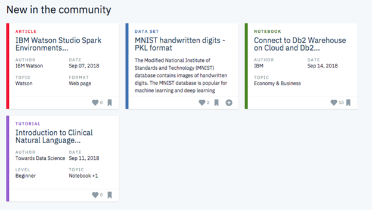

# Since you liked that you might also like this!
### Content Recommendation System for IBM Watson Studio 




## Table of Contents
1. [Description](#description)
2. [Getting Started](#getting_started)
	1. [Dependencies](#dependencies)
	2. [Installing](#installation)
	3. [Project Steps](#Project Steps)
	4. [Additional Material](#material)
3. [Authors](#authors)
4. [License](#license)
5. [Acknowledgement](#acknowledgement)
6. [Screenshots](#screenshots)

<a name="descripton"></a>

## Project Motivation

In the IBM Watson Studio, there is a large collaborative community ecosystem of articles, datasets, notebooks, and other A.I. and ML. assets. Users of the system interact with all of this. Within this scope, I created this recommendation system project to enhance the user experience and connect them with assets. This personalizes the experience for each user.

<a name="getting_started"></a>
## Description

Explored and analyzed the IBM Watson Studio platform data. Proceeded to create recommendations for users using rank based , user-user based collaborative filtering and content based methods. 


Key Skills Demonstrated:
* Exploratory Data Analysis
* Rank Based Recommendations
* User-User Based Collaborative Filtering
* Matrix Factorization

<a name="getting_started"></a>
## Project Steps
This project is divided in the following key sections:

I. Exploratory Data Analysis

Before making recommendations of any kind, I explored the data available on the IBM Watson Studio platform.

II. Rank Based Recommendations

To get started in building recommendations, I first found the most popular articles simply based on the most interactions. Since there are no ratings for any of the articles, it is easy to assume the articles with the most interactions are the most popular. These are then the articles we might recommend to new users (or anyone depending on what we know about them).

III. User-User Based Collaborative Filtering

In order to build better recommendations for the users of IBM's platform, I looked at users that are similar in terms of the items they have interacted with. These items could then be recommended to the similar users. This is a step in the right direction towards more personal recommendations for the users.

IV. Content Based Recommendations
Next, I built a recommender that performs a ranking of the highest ranked articles associated with some term.

V. Matrix Factorization

Finally, I completed a machine learning approach to building recommendations. Using the user-item interactions, I built out a matrix decomposition. Using the decomposition, I got an idea of how well I could predict new articles an individual might interact with. I then discussed which methods to use moving forward, and how to test how well the recommendations are working for engaging users.


<a name="dependencies"></a>
### Dependencies
* Python 3.5+
* Libraries: NumPy, Regular expressions, Seaborn, Pandas, Scikit-learn
* Natural Language Process Libraries: NLTK
* Others: progressbar, pycodestyle, pycodestyle_magic, flake8


<a name="installation"></a>
### Installing
To clone the git repository:
```
git clone https://github.com/toluwee/Disaster_response-with-ML.git
```

<a name="authors"></a>
## Authors

* [Tolu Olukoga](https://github.com/toluwee)

<a name="license"></a>
## License
[](https://opensource.org/licenses/MIT)

<a name="acknowledgement"></a>
## Acknowledgements

* [Udacity](https://www.udacity.com/) for providing an amazing Data Science Nanodegree Program
* [IBM Watson Studio platform](https://dataplatform.cloud.ibm.com/) for providing the relevant dataset to train the model

<a name="screenshots"></a>
## Recommendation Accuracy


